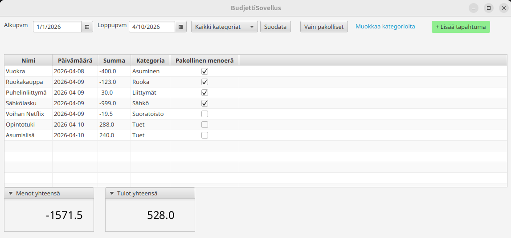
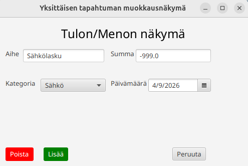
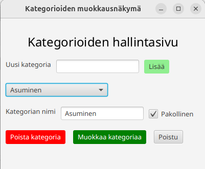

# BudjettiSovellus

Kulujen seurantaan tarkoitettu Jyväskylän yliopiston Ohjelmointi 2 -kurssin harjoitustyönä toteutettava JavaFX-sovellus.

Tällä sovelluksella voit seurata seurata tuloja ja menojasi.

### Päänäkymä

Päänäkymässä näet lisäämäsi tulot ja menot (tapahtumat). Voit myös suodattaa tapahtumia päivämäärien pohjalta, valita näytettäväksi yksittäisen kategorian tapahtumat tai näyttää vain niiden kategorioiden tapahtumat jotka on merkitty pakollisiksi.

Pystyt myös avaamaan kategorioiden muokkausnäkymän sekä avaamaan tapahtuman lisäysnäkymän. Lisäksi jo asetettuja tapahtumia pystyy muokkaamaan tuplaklikkaamalla tapahtumalistauksessa listattuna olevaa tapahtumaa.

Olemassa oleva tapahtuma on myös mahdollista poistaa painamalla "Poista"-näppäintä.

### Tapahtumanäkymä

Tapahtumanäkymässä pystyt joko lisäämään uuden tapahtuman tai muokkaamaan olemassa olevia tapahtumia. Voit asettaa tapahtumalle nimen (aihe), summan, kategorian sekä päivämäärän. Huomaathan että meno lisätään antamalla negatiivinen summa ja tulo antamalla positiivinen summa. Tapahtuma luokitellaan siis sen summan perusteella.

### Kategorianäkymä

Kategorianäkymässä pystyt hallitsemaan kategorioita. Voit lisätä uuden kategorian sekä tarkastella kategorian tietoja ja/tai muokata kategoriaa valitsemalla kategorian vetolaatikosta. Voit myös poistaa kategorioita tämän näkymän kautta. Huomaatathan että silloin kategoria poistuu myös tapahtumilta joille se on mahdollisesti toimestasi asetettu.

Vaihtamalla "Pakollinen"-arvoa vaikutat siihen listataanko kategorian kaikki tapahtumat pakollisina päänäkymän tapahtumalistauksessa.

Painamalla "Muokkaa kategoriaa"-näppäintä saat muutokset tallennettua.