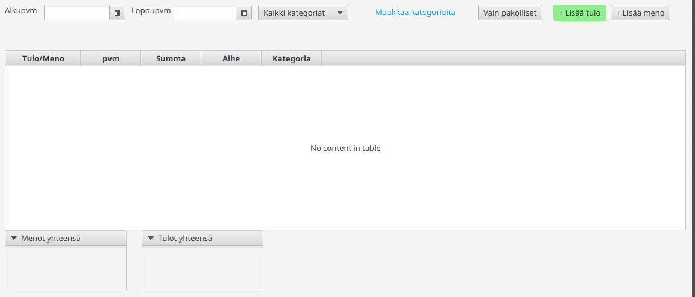
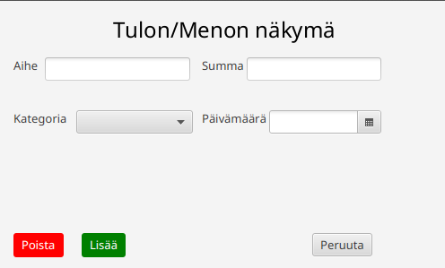
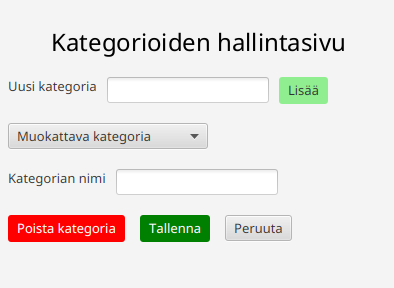

# Käyttöliittymäsuunnitelma

## Päänäkymä

**Olennaiset toiminnot**

- Käyttäjä näkee käyttöliittymässä taulukkona listauksen meno/tulo-tapahtumia, taulukon yläpuolella filttereitä joilla suodattaa tapahtumia ja tämän lisäksi ylhäällä oikealla on myös painikkeita joilla muokata kategorioita tai tapahtumia. Alaosassa lisäksi näytetään menojen ja tulojen yhteissummat.
- Näkymään pääsee avaamalla sovelluksen, tämä näkymä avautuu aina oletuksena.
- Käyttäjä voi suodattaa tapahtumia taulukon yläpuolella olevien filttereiden avulla, kuten alku- ja loppupäivämäärä sekä kategoria-valitsin. Käyttäjä pystyy myös avaamaan kategorioiden muokkausnäkymän sekä näkymän josta saa lisättyä uuden tapahtuman. Olemassa olevia tapahtumia pystyy myös muokkaamaan tuplaklikkaamalla valittua tapahtumaa taulukossa.

## Tapahtuman lisäys ja muokkaus

Käytetään sekä lisättäessä tapahtumaa että muokattaessa sitä.

**Olennaiset toiminnot**

- Käyttäjä näkee joko menneen tapahtuman tiedot (mikäli on avannut vanhan tapahtuman muokkausnäykmän) tai tapahtuman lisäämiseen vaadittavat inputit tyhjinä.
- Tähän näkymään pääsee joko klikkaamalla päänäkymässä "Lisää tulo" tai "Lisää meno" painiketta, tai vaihtoehtoisesti tänne myös päätyy mikäli tuplaklikkaa päänäkymässä mennyttä tapahtumaa sen ollessa valittuna taulukossa.
- Käyttäjä voi muokata tapahtuman tietoja, perua muokkauksen/lisäyksen tai kyseessä ollessa jo vanha tapahtuma, on mahdollista myös poistaa se.

## Kategorioiden muokkaussivu

**Olennaiset toiminnot**

- Käyttäjä näkee inputin ja painikkeen mistä lisätä uusi kategoria. Heti tämän alapuolelta pääseem muokkaamaan olemassa olevia kategorioita, valitsemalla kategorian, jolloin kategorian nimi latautuu alle muokattavaksi.
- Näkymään pääsee klikkaamalla päänäkymässä linkkiä "Muokkaa kategorioita".
- Käyttäjä voi lisätä uuden kategorian, valita muokattavan kategorian, muokata sen nimeä, ja tallentaa uuden nimen, poistaa olemassa olevan kategorian tai peruuttaa muokkauksen (mikä sulkee näkymän).